# 🛡️ SIEM Lab Setup Snapshots (Elastic Stack)

## 🎯 Purpose
This document provides structured evidence of the full lab setup for the Free SIEM Lab (Elastic Stack). It covers VM deployment, network configuration, connectivity validation, and SIEM stack initialization.

---

# 🧱 1. Virtual Machine Setup

## 1.1 Kali Linux (Attacker VM)
- Role: Attack simulation machine
- Tools: nmap, hydra, reconnaissance tools

📸 Snapshot:
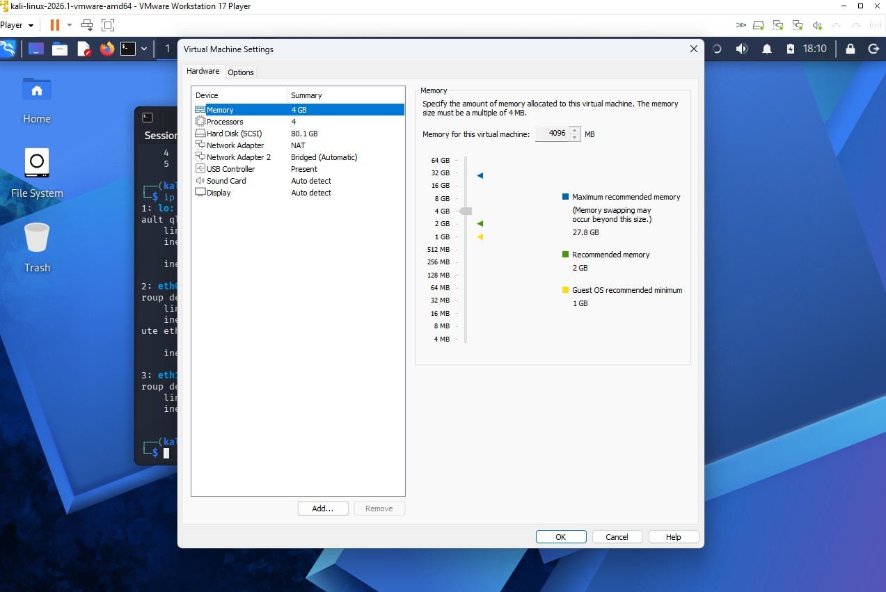

---

## 1.2 SIEM Server (Elastic Stack)
- Role: Central logging and analysis platform
- Services: Elasticsearch, Kibana
- IP: 192.168.56.10

📸 Snapshot:
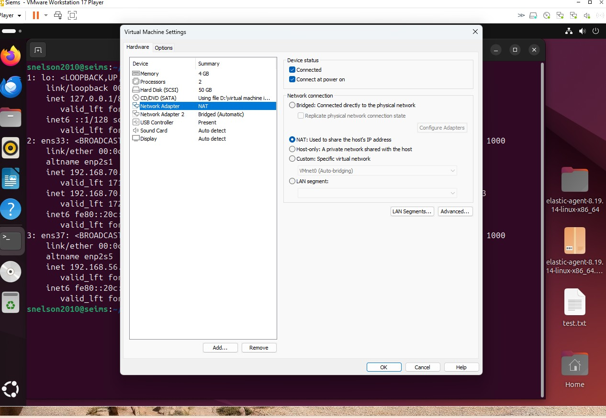

---

## 1.3 Target Server Configuration
- Role: Log generation (victim machine)
- OS: Ubuntu Server
- Agents: Filebeat / Elastic Agent

📸 Snapshot:
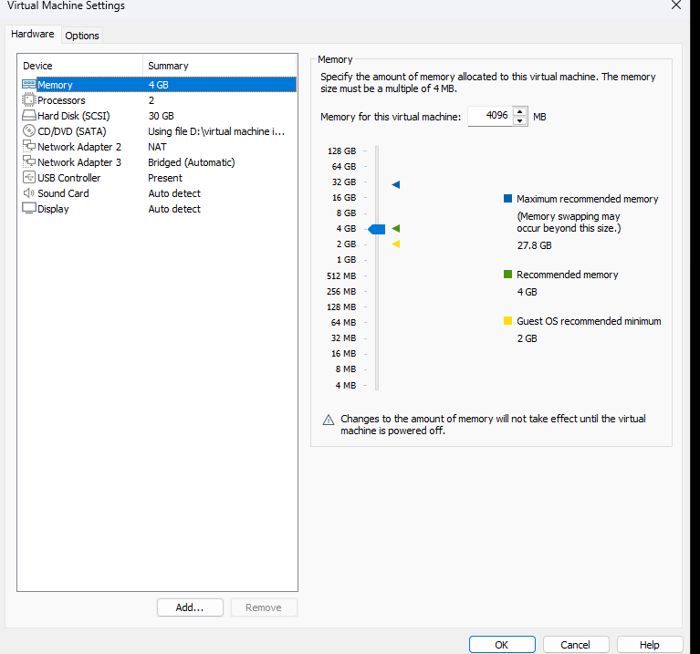

---

# 🌐 2. Network Configuration

## 2.1 SIEM Network Configuration
- VMnet1: 192.168.56.0/24
- Purpose: SIEM communication layer

📸 Snapshot:
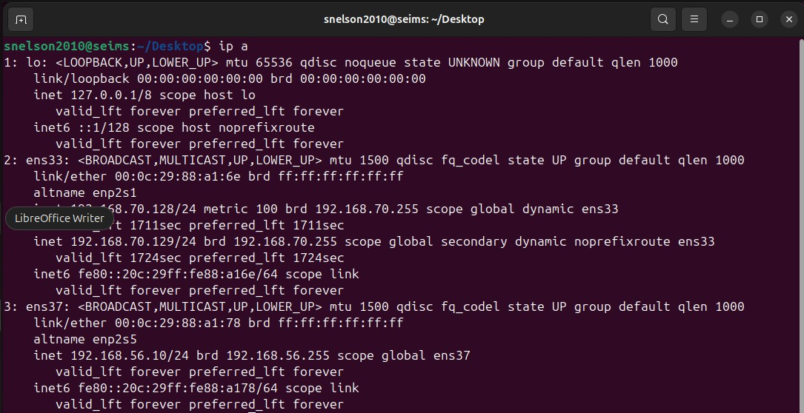

---

## 2.2 Target Network Configuration
- VMnet2: 192.168.70.0/24
- Purpose: Attack + target communication layer

📸 Snapshot:
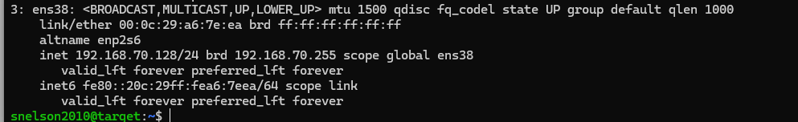

---

## 2.3 Kali Network Configuration
- IP assignment for attacker machine
- Confirms connectivity in attack network

📸 Snapshot:
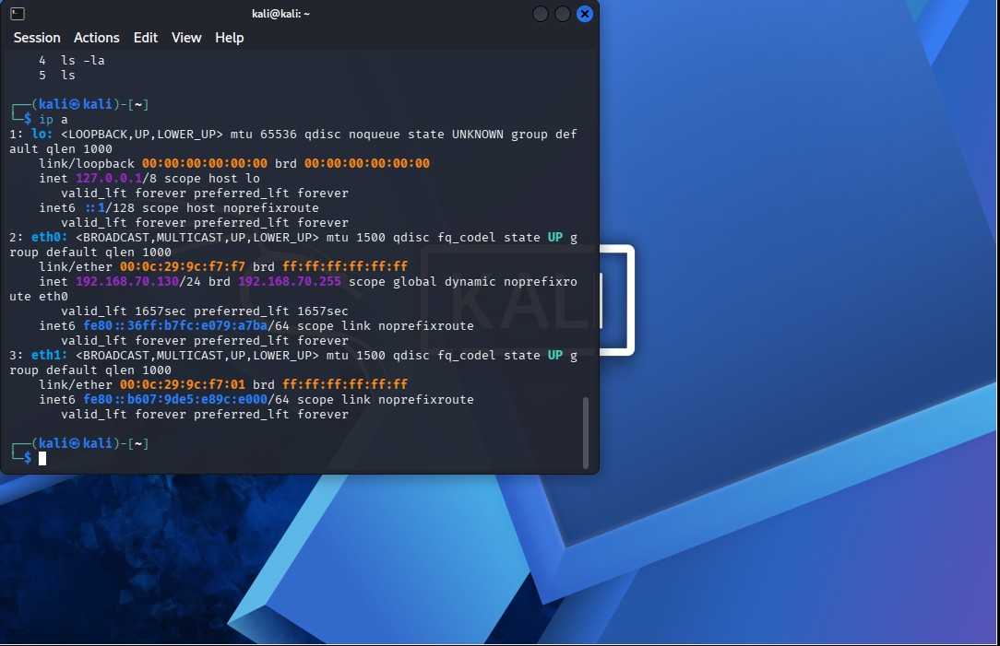

---

# 🔗 3. Connectivity Verification

## 3.1 Kali → Target Connectivity
- Confirms attacker can reach victim machine

📸 Snapshot:
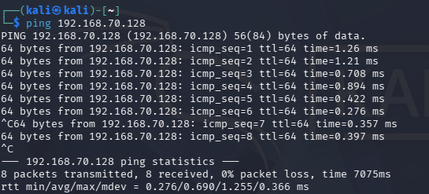

---

## 3.2 Target → SIEM Connectivity
- Confirms logs can reach Elasticsearch/Kibana server

📸 Snapshot:
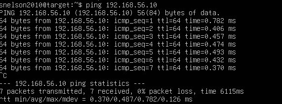

---

# 🧠 4. SIEM Stack Initialization

## 4.1 Kibana Login Page
- Confirms Kibana UI is accessible

📸 Snapshot:
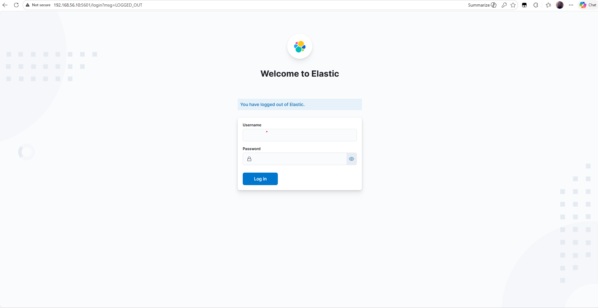

---

## 4.2 Fleet Agents Connected
- Shows Elastic Agent enrollment success
- Confirms log ingestion pipeline readiness

📸 Snapshot:
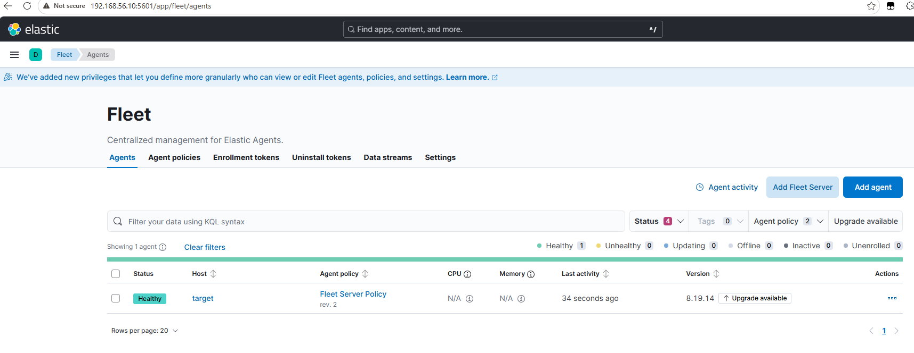

---

## 4.3 Elasticsearch Health Status
- Verifies cluster is healthy (green/yellow status)

📸 Snapshot:
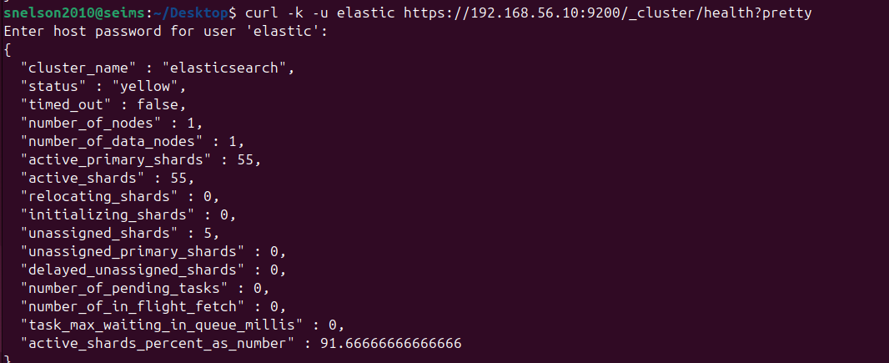

---

# 🧠 Summary

This setup phase confirms:

- All VMs are correctly deployed
- Network segmentation is functional
- Attacker, target, and SIEM roles are properly isolated
- Elastic Stack is running and accessible
- Fleet/agents are successfully connected
- System is ready for log ingestion and security monitoring

---

# 📌 File Naming Convention

All snapshots follow strict naming:

- 01-kali-vm.jpg
- 02-siem-vm-elastic.jpg
- 03-target-vm-config.png
- 04-siem-ip-config.jpg
- 05-target-ip-config.png
- 06-kali-ip-config.jpg
- 07-kali-target-connectivity.png
- 08-target-to-siem-connectivity.png
- 09-kibana-login-page.png
- 10-fleet-agents-connected.png
- 11-elasticsearch-health.png
