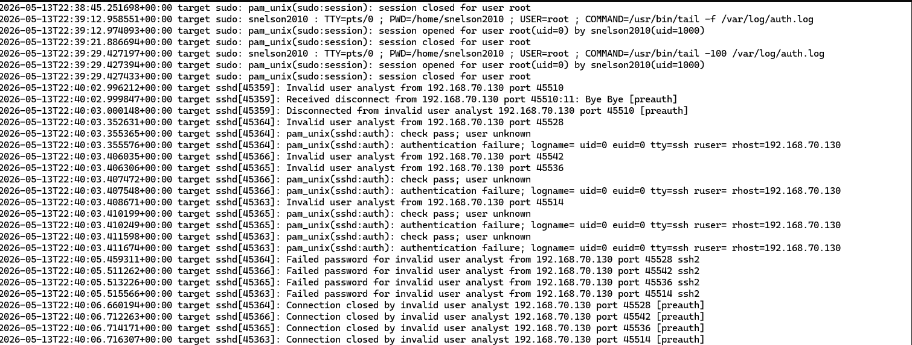

# Ingestion Pipeline Validation

## Purpose

This document validates that Linux authentication events are successfully generated on the target machine, collected by Elastic Agent, indexed in Elasticsearch, and searchable in Kibana.

The goal is to prove that the SIEM ingestion pipeline is working end to end.

---

## Validation Flow

```text
Kali Linux Attack VM
192.168.70.130
        ↓
Ubuntu Target VM
192.168.70.128
        ↓
Linux authentication logs / journald
        ↓
Elastic Agent enrolled in Fleet
192.168.56.30
        ↓
Elasticsearch
192.168.56.10
        ↓
Kibana Discover
```

---

## Lab Systems

| System | Role | IP Address | Purpose |
|---|---|---|---|
| Kali Linux | Attacker | `192.168.70.130` | Generates SSH login attempts |
| Ubuntu Target | Victim / Log Source | `192.168.70.128` | Receives simulated SSH activity |
| Ubuntu Target | Log Forwarding Interface | `192.168.56.30` | Sends telemetry to SIEM |
| SIEM Server | Elasticsearch / Kibana | `192.168.56.10` | Stores and analyzes logs |

---

## Step 1 — Generate Authentication Activity

From Kali Linux, generate failed SSH login attempts against the Ubuntu target.

```bash
ssh fakeuser@192.168.70.128
```

A controlled Hydra test can also be used in the isolated lab environment:

```bash
hydra -l analyst -P passwords.txt ssh://192.168.70.128 -t 2
```

> This activity is performed only against systems owned and controlled in the isolated lab environment.

---

## Step 2 — Validate Logs on the Target

On the Ubuntu target machine, verify that authentication events are being generated.

Depending on Linux logging configuration, events may appear in journald or a local authentication log file.

### Check SSH logs with journalctl

```bash
sudo journalctl | grep ssh
```

### Check auth.log if available

```bash
sudo tail -f /var/log/auth.log
```

### Check secure log if available

```bash
sudo tail -f /var/log/secure
```

Expected events may include:

```text
Failed password for invalid user fakeuser from 192.168.70.130
Failed password for analyst from 192.168.70.130
Accepted password for analyst from 192.168.70.130
```

### Evidence



---

## Step 3 — Validate Elastic Agent Status

On the target machine:

```bash
sudo elastic-agent status
```

Also verify the service:

```bash
sudo systemctl status elastic-agent
```

In Kibana, navigate to:

```text
Management → Fleet → Agents
```

The target host should show as healthy or online.

### Evidence


---

## Step 4 — Validate Events in Kibana Discover

In Kibana, open:

```text
Analytics → Discover
```

Recommended time range:

```text
Last 15 minutes
```

If no logs appear, increase the time range:

```text
Last 30 days
```

### Evidence


---

## Useful KQL Queries

### Parsed failed SSH events

```kql
system.auth.ssh.event : "Failed"
```

### Parsed accepted SSH events

```kql
system.auth.ssh.event : "Accepted"
```

### All authentication dataset events

```kql
data_stream.dataset : "system.auth"
```

### Failed password raw message search

```kql
message : "Failed password"
```

### Invalid user attempts

```kql
message : "invalid user"
```

### Sudo activity

```kql
message : "sudo"
```

---

## Validation Result

Authentication events were successfully generated on the target system and verified in Kibana Discover.

This confirms that the pipeline from Linux log generation to Elastic search and analysis is operational.

---

## Security Value

Pipeline validation is important because detection rules and dashboards are only useful if the underlying telemetry is reliable.

This validation confirms:

- Linux authentication events are generated
- Elastic Agent is collecting endpoint telemetry
- Events are indexed in Elasticsearch
- Kibana can search and display authentication activity
- Parsed SSH fields such as `system.auth.ssh.event` are available
- The lab can support detection engineering and SOC analysis

---

## CISSP Domain Alignment

| CISSP Domain | Relevance |
|---|---|
| Domain 7: Security Operations | Log monitoring and SIEM validation |
| Domain 6: Security Assessment and Testing | Testing security controls through simulated activity |
| Domain 5: Identity and Access Management | Monitoring authentication attempts |
| Domain 4: Communication and Network Security | Observing SSH access over the lab network |

---

## Notes

- Elastic Agent is the collection method used in this lab.
- Standalone Filebeat was not installed separately on the target system.
- Kali Linux uses `192.168.70.130`.
- The target attack-facing IP is `192.168.70.128`.
- The target log-forwarding IP is `192.168.56.30`.
- The SIEM server uses `192.168.56.10`.
