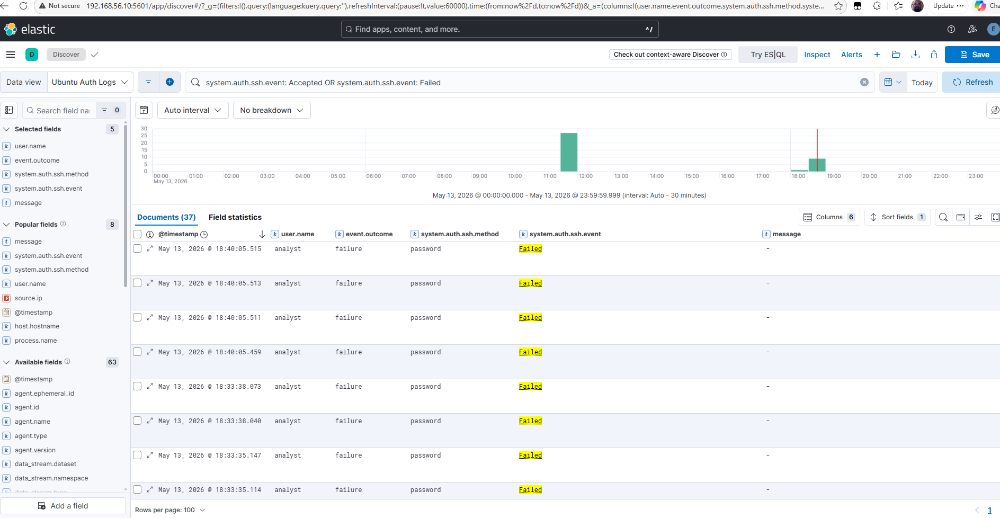

# Failed SSH Login Detection

## Purpose

This detection identifies failed SSH authentication attempts on the Ubuntu target server.

Failed login monitoring helps identify:

- invalid username attempts
- password guessing
- brute force behavior
- unauthorized access attempts

---

## Lab Systems

| System | Role | IP Address |
|---|---|---|
| Kali Linux | Attacker | `192.168.70.130` |
| Ubuntu Target | Victim / Log Source | `192.168.70.128` |
| Ubuntu Target | Log Forwarding Interface | `192.168.56.30` |
| SIEM Server | Elasticsearch / Kibana | `192.168.56.10` |

---

## Detection Logic

### Primary parsed field query

```kql
system.auth.ssh.event : "Failed"
```

### Raw message fallback query

```kql
message : "Failed password"
```

### Scoped authentication dataset query

```kql
data_stream.dataset : "system.auth" and system.auth.ssh.event : "Failed"
```

---

## Custom Rule Configuration

The custom Elastic Security rule was created as a threshold rule using the parsed SSH event field.

| Setting | Value |
|---|---|
| Rule name | `lab` |
| Rule type | `threshold` |
| Rule query | `system.auth.ssh.event : "Failed"` |
| Threshold field | `source.ip` |
| Threshold value | `5` |
| Rule interval | `5m` |
| Lookback window | `now-6m` |
| Alert severity | `high` |
| Risk score | `73` |
| Index | `logs-system.auth-default` |

---

## Expected Events

Typical SSH authentication failures include:

```text
Failed password for invalid user
Failed password for analyst
Failed password for root
```

These events are generated when an attacker attempts invalid SSH logins against the target system.

---

## Attack Simulation Source

The failed login events were generated from Kali Linux using:

- SSH login attempts
- controlled Hydra brute force testing

Target system:

```text
192.168.70.128
```

Attacker system:

```text
192.168.70.130
```

---

## Screenshot Evidence

### Failed SSH Login Events

This screenshot shows failed SSH login events successfully ingested and visible in Kibana.



---

## Alert Validation

A custom detection rule successfully generated an alert after repeated failed SSH authentication events from Kali Linux.

Validation details:

| Field | Value |
|---|---|
| Rule name | `lab` |
| Rule type | `threshold` |
| Alert severity | `high` |
| Risk score | `73` |
| Source IP | `192.168.70.130` |
| Validation location | Security → Alerts |
| Alert reason | Event with source `192.168.70.130` created high alert `lab` |
| Alert status | `open` |


---

## Alert JSON Validation

The generated alert confirms that the custom threshold rule matched repeated failed SSH authentication events from the Kali attacker IP.

| Field | Value |
|---|---|
| Rule type | `threshold` |
| Rule query | `system.auth.ssh.event : "Failed"` |
| Threshold field | `source.ip` |
| Threshold value | `5` |
| Threshold result count | `8` |
| Threshold result source | `192.168.70.130` |
| Source IP | `192.168.70.130` |
| Alert severity | `high` |
| Risk score | `73` |
| Source index | `logs-system.auth-default` |
| Alert status | `open` |
| Alert reason | `event with source 192.168.70.130 created high alert lab.` |

Key fields validated:

```text
kibana.alert.rule.type = threshold
kibana.alert.rule.parameters.query = system.auth.ssh.event : "Failed"
kibana.alert.threshold_result.count = 8
kibana.alert.threshold_result.terms.value = 192.168.70.130
source.ip = 192.168.70.130
kibana.alert.rule.indices = logs-system.auth-default
```

---

## Detection Workflow

```text
Hydra / SSH activity from Kali
        ↓
Failed SSH log generated on Ubuntu target
        ↓
Elastic Agent collects authentication event
        ↓
Event indexed in Elasticsearch
        ↓
Kibana rule evaluates failed SSH activity
        ↓
Alert appears in Security → Alerts
```

---

## Investigation Workflow

```text
Alert generated
        ↓
Review source IP
        ↓
Review username targeted
        ↓
Check number of failed attempts
        ↓
Determine brute force likelihood
        ↓
Document alert evidence
```

---

## MITRE ATT&CK Mapping

| Technique | Description | Lab Evidence |
|---|---|---|
| T1110 | Brute Force | Repeated SSH authentication failures from Kali |

---

## CISSP Domain Alignment

| CISSP Domain | Relevance |
|---|---|
| Domain 5: Identity and Access Management | Authentication monitoring |
| Domain 6: Security Assessment and Testing | Attack validation |
| Domain 7: Security Operations | Detection, alerting, and investigation |

---

## Notes

- Elastic Agent collects Linux authentication logs from the target server.
- Standalone Filebeat was not installed separately on the target system.
- Authentication events are searchable in Kibana Discover.
- The custom alert validated that failed SSH activity can generate SIEM alerts.
- Failed login activity was intentionally generated inside the isolated VMware lab.
