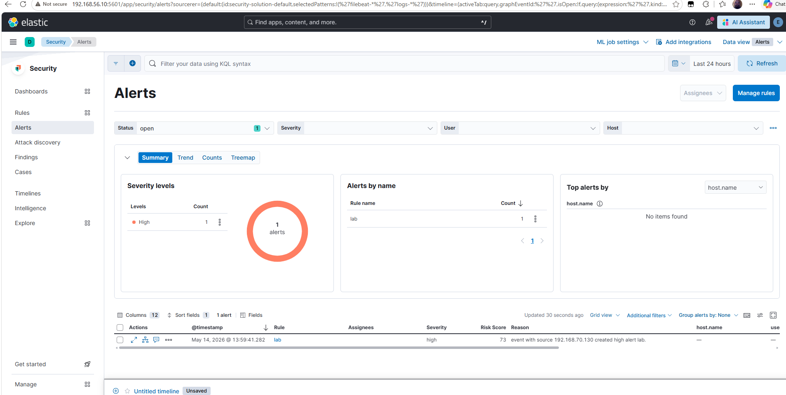
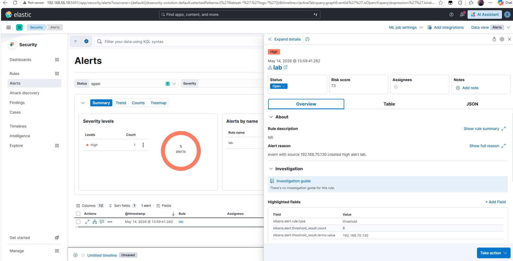

# SSH Brute Force Detection

## Purpose

This document describes the custom SSH brute force detection built in the Elastic SIEM lab.

The detection identifies repeated failed SSH authentication attempts from the same source IP address. This activity may indicate password guessing, credential stuffing, or brute force behavior.

---

## Lab Systems

| System | Role | IP Address |
|---|---|---|
| Kali Linux | Attacker | `192.168.70.130` |
| Ubuntu Target | Victim / Log Source | `192.168.70.128` |
| Ubuntu Target | Log Forwarding Interface | `192.168.56.30` |
| SIEM Server | Elasticsearch / Kibana | `192.168.56.10` |

---

## Detection Logic

The rule uses the parsed SSH authentication field available in Kibana:

```kql
system.auth.ssh.event : "Failed"
```

This query identifies failed SSH authentication events collected from the Ubuntu target server.

---

## Rule Type

A threshold rule was used to detect repeated failed SSH attempts from the same source IP.

| Setting | Value |
|---|---|
| Rule name | `lab` |
| Rule type | `threshold` |
| Query language | KQL / Kuery |
| Rule query | `system.auth.ssh.event : "Failed"` |
| Threshold field | `source.ip` |
| Threshold value | `5` |
| Rule interval | `5m` |
| Lookback window | `now-6m` |
| Severity | `high` |
| Risk score | `73` |
| Index | `logs-system.auth-default` |

---

## Attack Simulation

The detection was validated using controlled SSH authentication activity from Kali Linux.

Example test command:

```bash
hydra -l analyst -P passwords.txt ssh://192.168.70.128 -t 2
```

This generated repeated failed SSH login events from:

```text
192.168.70.130
```

---

## Alert Validation

The custom rule generated a high-severity alert in Elastic Security.

| Field | Value |
|---|---|
| Alert status | `open` |
| Rule type | `threshold` |
| Alert severity | `high` |
| Risk score | `73` |
| Source IP | `192.168.70.130` |
| Threshold result count | `8` |
| Threshold field | `source.ip` |
| Source index | `logs-system.auth-default` |
| Alert reason | `event with source 192.168.70.130 created high alert lab.` |

---

## Screenshot Evidence

### Alert Summary

This screenshot shows the generated alert in the Elastic Security Alerts page.



### Alert Details

This screenshot shows the alert detail panel, including threshold count and source IP.



---

## Detection Workflow

```text
Hydra SSH brute force attempt
        ↓
Target records failed SSH authentication events
        ↓
Elastic Agent forwards events to Elasticsearch
        ↓
Elastic threshold rule evaluates failed SSH events
        ↓
Events are grouped by source.ip
        ↓
Threshold exceeded
        ↓
High-severity alert generated
```

---

## Analyst Investigation Steps

If this alert appeared in a real environment, an analyst should:

1. Review the source IP address.
2. Identify targeted usernames.
3. Check whether any successful SSH login occurred after the failures.
4. Review host authentication logs.
5. Determine whether the source should be blocked or restricted.
6. Recommend SSH hardening such as key-based authentication, MFA, rate limiting, or fail2ban.

---

## MITRE ATT&CK Mapping

| Technique | Description | Lab Evidence |
|---|---|---|
| T1110 | Brute Force | Repeated failed SSH authentication attempts |

---

## CISSP Domain Alignment

| CISSP Domain | Relevance |
|---|---|
| Domain 5: Identity and Access Management | Authentication monitoring and account protection |
| Domain 6: Security Assessment and Testing | Controlled brute force simulation and validation |
| Domain 7: Security Operations | Alert triage, detection engineering, and incident response |

---

## Lessons Learned

- Prebuilt rules may not always match the available lab data sources.
- Custom rules can be built using fields confirmed in Discover.
- `system.auth.ssh.event` was the most reliable parsed field for SSH authentication status in this lab.
- Threshold rules are useful for detecting repeated activity from a single source.
- Alert validation should include both screenshot evidence and field-level JSON validation.

---

## Notes

- This test was performed only in an isolated VMware lab.
- Elastic Agent was used for log collection.
- Standalone Filebeat was not installed separately on the target system.
- The custom threshold rule matched data from `logs-system.auth-default`.
