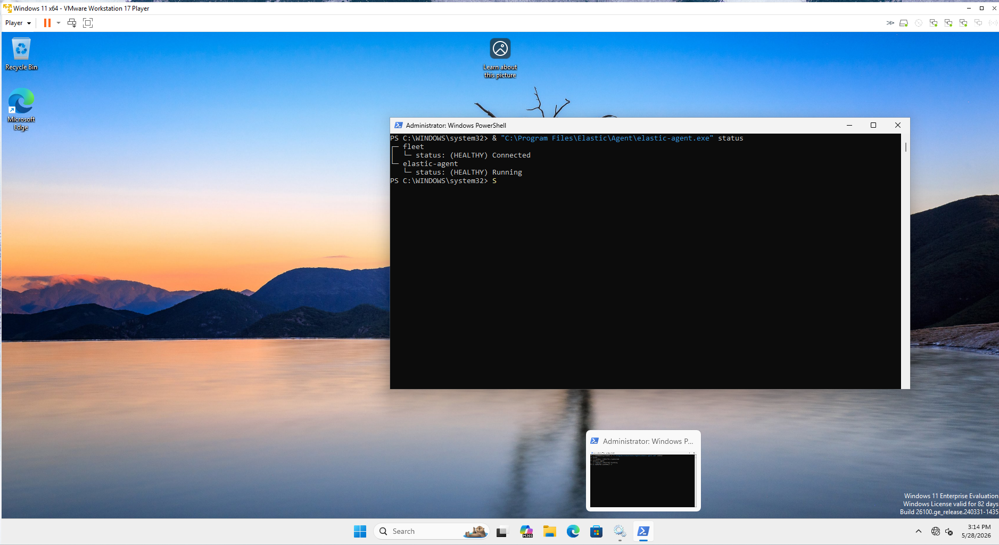
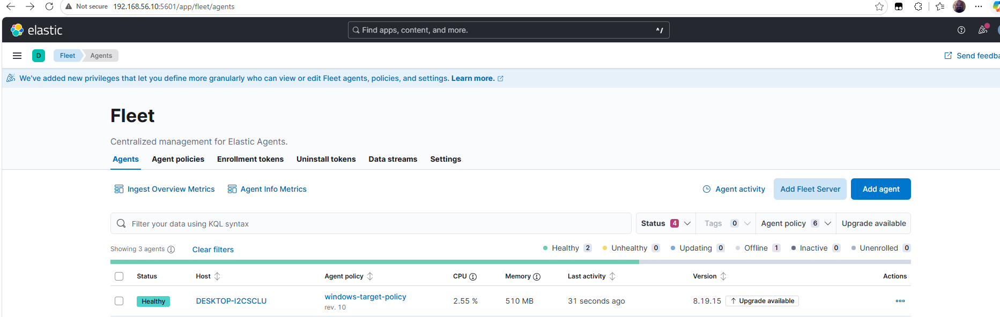
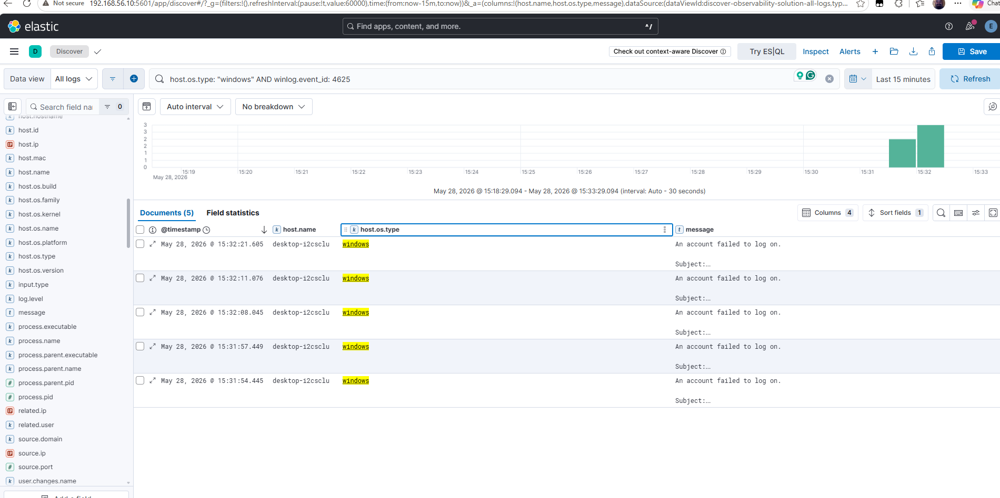
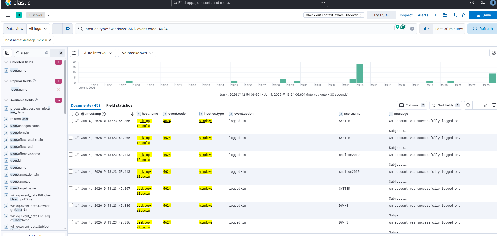
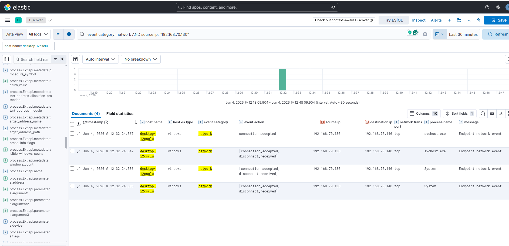
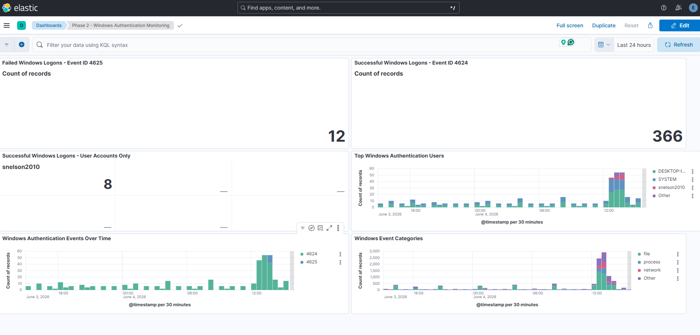
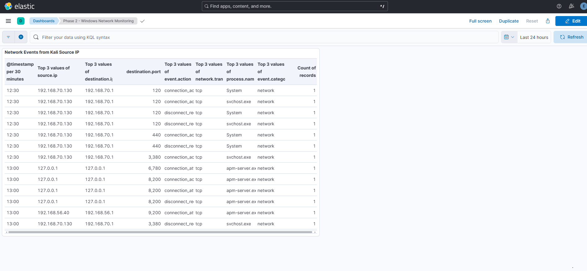

# Phase 2 Screenshot Evidence Index

## Purpose

This document explains the screenshots collected for Phase 2 of the CISSP Risk Management and Incident Response Expansion. The screenshots provide evidence that a Windows Enterprise VM was added as a new monitored endpoint and that the Elastic SIEM lab is collecting Windows endpoint data.

---

## Evidence Summary

| Evidence Item | Screenshot File | What It Proves | CISSP Domain Alignment |
|---|---|---|---|
| Windows Elastic Agent status from PowerShell | [windows-agent-powershell-healthy.png](windows-agent-powershell-healthy.png) | Shows the Windows Enterprise VM has Elastic Agent installed, running, and connected to Fleet | Domain 7: Security Operations |
| Windows endpoint healthy in Fleet | [fleet-windows-agent-healthy.png](fleet-windows-agent-healthy.png) | Shows the Windows VM is enrolled in Fleet and reporting as healthy under the Windows target policy | Domain 7: Security Operations |
| Windows failed logon events in Kibana Discover | [phase-2-windows-failed-logon-4625-discover.png](phase-2-windows-failed-logon-4625-discover.png) | Shows Windows failed logon Event ID 4625 events generated by wrong password attempts and visible in Kibana | Domain 5: Identity and Access Management; Domain 6: Security Assessment and Testing; Domain 7: Security Operations |
| Windows successful logon events in Kibana Discover | [phase-2-windows-successful-logon-4624-discover.png](phase-2-windows-successful-logon-4624-discover.png) | Shows Windows successful logon Event ID 4624 events visible in Kibana | Domain 5: Identity and Access Management; Domain 7: Security Operations |
| Windows network events in Kibana Discover | [phase-2-nmap-related-windows-network-events.png](phase-2-nmap-related-windows-network-events.png) | Shows Windows endpoint network telemetry during Nmap-related testing from the Kali source IP | Domain 4: Communication and Network Security; Domain 6: Security Assessment and Testing; Domain 7: Security Operations |
| Windows authentication monitoring dashboard | [phase-2-windows-authentication-dashboard.png](phase-2-windows-authentication-dashboard.png) | Shows dashboard panels for failed logons, successful logons, user logons, authentication trends, and event categories | Domain 5: Identity and Access Management; Domain 7: Security Operations |
| Windows network monitoring dashboard | [phase-2-windows-network-monitoring-dashboard.png](phase-2-windows-network-monitoring-dashboard.png) | Shows dashboard view of Windows network telemetry and Kali-source network activity | Domain 4: Communication and Network Security; Domain 6: Security Assessment and Testing; Domain 7: Security Operations |
| Windows agent details or policy evidence | [windows-agent-policy-or-agent-details.png](windows-agent-policy-or-agent-details.png) | Shows the Windows endpoint policy, integrations, or agent details used for log collection | Domain 6: Security Assessment and Testing; Domain 7: Security Operations |

---

## Evidence 1: Windows Elastic Agent Healthy in PowerShell



This screenshot shows the Elastic Agent status from PowerShell on the Windows Enterprise VM. The output confirms that the agent is running and connected to Fleet.

### Security Value

This proves the Windows VM is no longer just a standalone virtual machine. It is now part of the monitored SIEM environment.

### CISSP Relevance

- Domain 7: Security Operations
- Monitoring and logging
- Endpoint visibility
- Operational security validation

---

## Evidence 2: Windows Endpoint Healthy in Fleet



This screenshot shows the Windows Enterprise VM listed in Kibana Fleet with a healthy status. It also shows the assigned Windows agent policy.

### Security Value

This proves centralized management is working and that the Windows endpoint can be monitored through Fleet.

### CISSP Relevance

- Domain 7: Security Operations
- Centralized monitoring
- Asset visibility
- Endpoint management

---

## Evidence 3: Windows Failed Logon Events in Kibana Discover



This screenshot shows failed Windows logon events generated by entering the wrong password multiple times on the Windows Enterprise VM.

The Kibana Discover search used was similar to:

```text
host.os.type: "windows" AND winlog.event_id: 4625
```

The results show Event ID 4625 with the message:

```text
An account failed to log on.
```

### Security Value

This is strong evidence that the Windows VM is producing searchable authentication security events. It supports incident response, access control monitoring, and failed logon investigation.

### CISSP Relevance

- Domain 5: Identity and Access Management
- Domain 6: Security Assessment and Testing
- Domain 7: Security Operations
- Authentication monitoring
- Event monitoring
- Evidence collection

---

## Evidence 4: Windows Successful Logon Events in Kibana Discover



This screenshot shows successful Windows logon events on the Windows Enterprise VM.

The Kibana Discover search used was similar to:

```text
host.os.type: "windows" AND event.code: 4624
```

The results show Event ID 4624 with the message:

```text
An account was successfully logged on.
```

### Security Value

This evidence shows that the SIEM can monitor successful authentication events in addition to failed authentication attempts. Successful logon visibility is important for reviewing account activity, confirming access, and investigating whether suspicious failed logons were followed by a successful logon.

### CISSP Relevance

- Domain 5: Identity and Access Management
- Domain 7: Security Operations
- Successful authentication monitoring
- Account activity review
- Evidence collection

---

## Evidence 5: Windows Network Events During Nmap-Related Testing



This screenshot shows Windows endpoint network telemetry in Kibana Discover during Nmap-related testing from the Kali attacker VM.

The events are useful when correlated with:

1. The Kali source IP address
2. The scan timestamp
3. Windows endpoint network events in Discover

### Security Value

This demonstrates that the Windows endpoint is producing network telemetry that can be reviewed during reconnaissance testing. If only limited ports appear, that is also useful because it identifies a visibility gap and shows where firewall or network-flow logging could be improved.

### CISSP Relevance

- Domain 4: Communication and Network Security
- Domain 6: Security Assessment and Testing
- Domain 7: Security Operations
- Network monitoring
- Detection validation
- Visibility gap identification

---

## Evidence 6: Windows Authentication Monitoring Dashboard



This screenshot shows a Kibana dashboard created for Windows authentication monitoring. It includes panels for failed Windows logons, successful Windows logons, actual user logons, top authentication users, authentication activity over time, and Windows event categories.

### Security Value

This dashboard provides a SOC-style view of Windows authentication activity and supports ongoing monitoring of account access events.

### CISSP Relevance

- Domain 5: Identity and Access Management
- Domain 7: Security Operations
- Authentication monitoring
- Dashboard-based investigation
- Evidence collection

---

## Evidence 7: Windows Network Monitoring Dashboard



This screenshot shows a Kibana dashboard created for Windows network monitoring. It summarizes Windows endpoint network telemetry and supports review of Kali-source network activity.

### Security Value

This dashboard supports network telemetry review, reconnaissance analysis, and visibility-gap documentation.

### CISSP Relevance

- Domain 4: Communication and Network Security
- Domain 6: Security Assessment and Testing
- Domain 7: Security Operations
- Network monitoring
- Reconnaissance review
- Detection validation

---

## Evidence 8: Windows Agent Policy or Agent Details


This screenshot should show the Windows endpoint details, agent policy, integrations, last check-in, or other Fleet details.

### Security Value

This supports the configuration side of the project and shows how the Windows endpoint is managed within the SIEM environment.

### CISSP Relevance

- Domain 6: Security Assessment and Testing
- Domain 7: Security Operations
- Configuration validation
- Control testing

---

## Phase 2 Justification

These screenshots demonstrate that Phase 2 added new capabilities to the original SIEM lab. The original project focused on building the Elastic SIEM environment. Phase 2 expands the environment by adding a Windows Enterprise endpoint and using it for monitoring, evidence collection, incident response, network reconnaissance testing, failed logon detection, successful logon monitoring, dashboard creation, and CISSP domain mapping.

This evidence supports the claim that Phase 2 is a new project expansion rather than a repeat of the original SIEM build.
