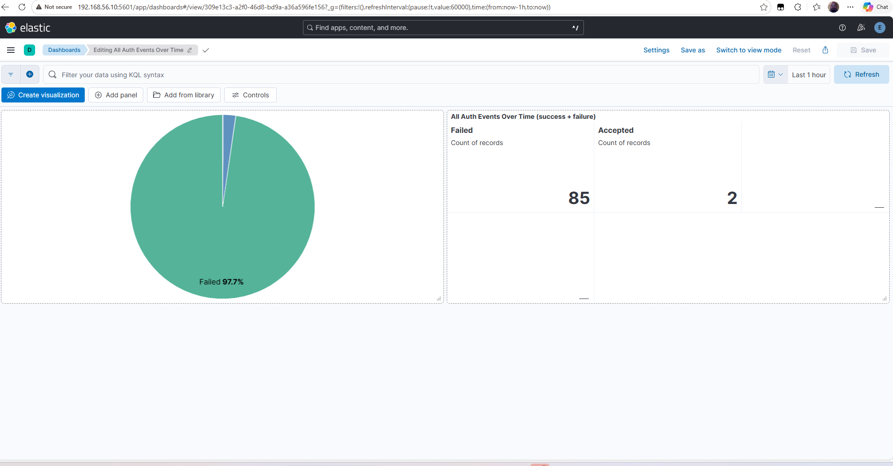

# Authentication Dashboard

## Purpose

This dashboard provides visibility into Linux SSH authentication activity collected from the Ubuntu target server and analyzed in Kibana.

The dashboard supports SOC-style investigation by showing failed SSH login activity, source IP addresses, usernames, and authentication trends over time.

---

## Dashboard Use Case

The authentication dashboard helps answer:

- Are failed SSH logins occurring?
- Which source IP is generating authentication failures?
- Which users are being targeted?
- Are failed logins increasing over time?
- Did attack simulation activity reach the SIEM?

---

## Data Source

| Component | Value |
|---|---|
| Collection method | Elastic Agent / Fleet |
| Dataset | `system.auth` |
| Main field | `system.auth.ssh.event` |
| Source IP field | `source.ip` |
| Username field | `user.name` |
| SIEM server | `192.168.56.10` |
| Target server | `192.168.70.128` |
| Kali attacker | `192.168.70.130` |

---

## Key KQL Queries

### Failed SSH events

```kql
system.auth.ssh.event : "Failed"
```

### Failed SSH events from Kali

```kql
system.auth.ssh.event : "Failed" and source.ip : "192.168.70.130"
```

### All authentication events

```kql
data_stream.dataset : "system.auth"
```

### Raw failed password fallback

```kql
message : "Failed password"
```

---

## Recommended Dashboard Panels

| Panel | Purpose |
|---|---|
| Failed SSH logins over time | Shows authentication failure trend |
| Failed logins by source IP | Identifies attacking systems |
| Failed logins by username | Shows targeted accounts |
| Authentication event table | Supports investigation and evidence review |
| SSH event outcome breakdown | Separates failed and accepted events |

---

## Screenshot Evidence

Dashboard screenshots are stored in:

```text
05-dashboards/image/
```

### All Authentication Events Over Time

This dashboard visualizes successful and failed SSH authentication activity collected from the Ubuntu target server.



### Top Attacking IP Dashboard

This dashboard highlights the primary attacking source IP, failed SSH activity trends, and the usernames targeted during the brute force simulation.


---

## SOC Investigation Workflow

```text
Review dashboard trend
        ↓
Identify spike in failed SSH events
        ↓
Filter by source.ip
        ↓
Review targeted usernames
        ↓
Pivot to Discover for raw events
        ↓
Confirm detection alert if threshold is exceeded
```

---

## Detection Linkage

This dashboard supports the detection work documented in:

```text
03-detections/failed-login-detection.md
03-detections/ssh-bruteforce-detection.md
```

The dashboard confirmed that failed SSH events from Kali Linux were visible before the custom threshold rule generated an alert.

---

## MITRE ATT&CK Mapping

| Technique | Description | Dashboard Evidence |
|---|---|---|
| T1110 | Brute Force | Failed SSH login attempts from Kali |

---

## CISSP Domain Alignment

| CISSP Domain | Relevance |
|---|---|
| Domain 5: Identity and Access Management | Authentication activity monitoring |
| Domain 6: Security Assessment and Testing | Validation of attack simulation visibility |
| Domain 7: Security Operations | SOC monitoring, dashboards, and alert triage |

---

## Lessons Learned

- Dashboards provide quick visibility into authentication activity.
- `source.ip` is useful for identifying attacking systems.
- `user.name` helps determine which accounts are being targeted.
- `system.auth.ssh.event` provides a clean field for failed and accepted SSH events.
- Dashboards should be validated before building final detection rules.
